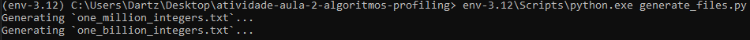
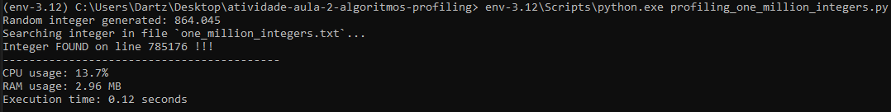
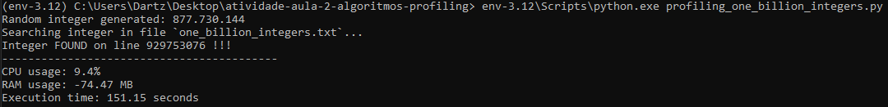
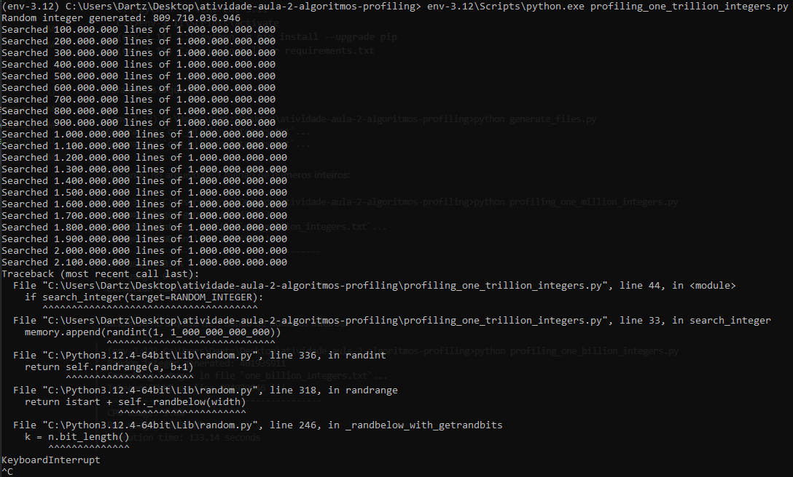

# Atividade - Aula 2 - Profiling - Estruturas e Complexidade de Algoritmos

Configurando o ambiente:

```bash
C:\>python -m venv env-3.11
C:\>env-3.11\Scripts\activate
(env-3.11) C:\>python -m pip install --upgrade pip
(env-3.11) C:\>pip install -r requirements.txt
```


Gerando os arquivos:




Buscando no arquivo de 1 milhão de números inteiros:




Buscando no arquivo de 1 bilhão de números inteiros:




Buscando no arquivo de 1 trilhão de números inteiros:


